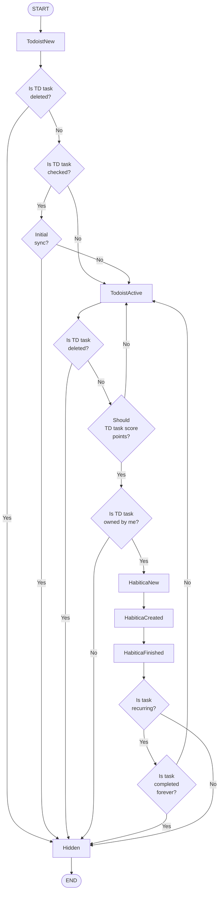

# Task state flow chart

```mermaid
graph TD
    start([START]) --> TodoistNew
    TodoistNew --> is_td_deleted{Is TD task\ndeleted?}
    is_td_deleted -- No --> is_td_checked{Is TD task\nchecked?}
    is_td_deleted -- Yes --> Hidden
    is_td_checked -- No --> TodoistActive
    is_td_checked -- Yes --> is_td_initial_sync{Initial\nsync?}
    is_td_initial_sync -- No --> TodoistActive
    is_td_initial_sync -- Yes --> Hidden
    TodoistActive --> is_td_deleted_active{Is TD task\ndeleted?}
    is_td_deleted_active -- Yes --> Hidden
    is_td_deleted_active -- No --> should_td_score_points{Should\nTD task score\npoints?}
    should_td_score_points -- Yes --> is_td_owned_by_me{Is TD task\nowned by me?}
    should_td_score_points -- No --> TodoistActive
    is_td_owned_by_me -- Yes --> HabiticaNew
    is_td_owned_by_me -- No --> Hidden
    HabiticaNew --> HabiticaCreated
    HabiticaCreated --> HabiticaFinished
    HabiticaFinished --> is_task_recurring{Is task\nrecurring?}
    is_task_recurring -- Yes --> is_task_completed{Is task\ncompleted\nforever?}
    is_task_completed -- No --> TodoistActive
    is_task_completed -- Yes --> Hidden
    is_task_recurring -- No --> Hidden
    Hidden --> finish([END])
```
