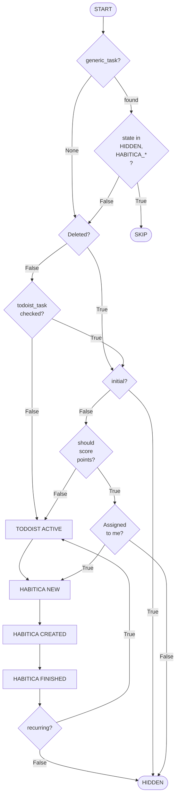

# Task state flow chart

```mermaid
graph TD
    start([START]) --> generic_task{generic_task?}
    generic_task -->|None| deleted{Deleted?}
    generic_task -->|found| state_in{state in<br/>HIDDEN,<br/>HABITICA_*<br/>?}
    deleted -->|False| todoist_task_checked{todoist_task<br/>checked?}
    deleted -->|True| initial{initial?}
    todoist_task_checked -->|False| todoist_active[TODOIST ACTIVE]
    todoist_task_checked -->|True| initial
    todoist_active --> habitica_new[HABITICA NEW]
    habitica_new --> habitica_created[HABITICA CREATED]
    habitica_created --> habitica_finished[HABITICA FINISHED]
    habitica_finished --> recurring{recurring?}
    recurring -->|False| hidden([HIDDEN])
    recurring -->|True| todoist_active
    initial -->|True| hidden
    initial -->|False| should_score_points{should<br/>score<br/>points?}
    should_score_points -->|False| todoist_active
    should_score_points -->|True| assigned_to_me{Assigned<br/>to me?}
    assigned_to_me -->|True| habitica_new
    assigned_to_me -->|False| hidden
    state_in -->|True| skip([SKIP])
    state_in -->|False| deleted
```